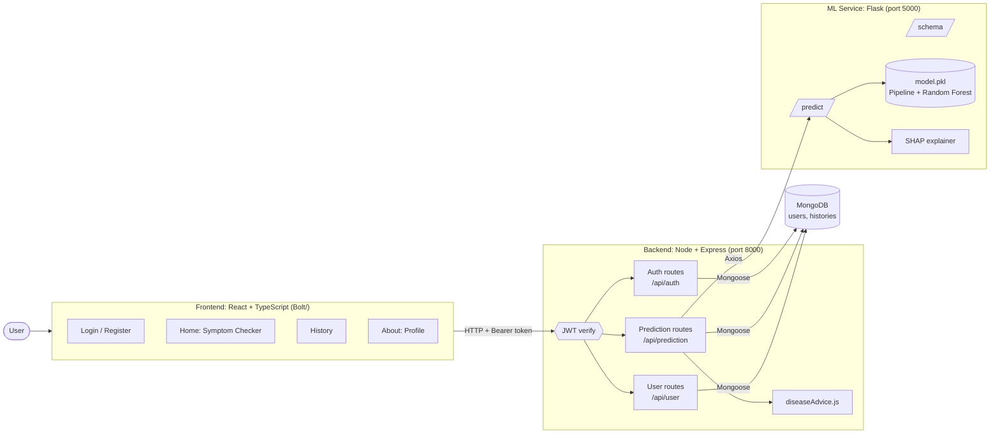

# AI Health Predictor — Hybrid Framework for Symptom-Based Disease Prediction

> A full-stack web application that predicts the most likely disease from a user's symptoms and lifestyle details using a Random Forest model, explains the result, and returns structured health guidance, with per-user prediction history.

[]()
[]()
[]()
[]()
[]()
[]()
[]()
[]()

> **Medical disclaimer:** This project is for **educational and demonstration purposes only**. It is trained on a synthetic dataset and is **not** a medical device or a substitute for professional diagnosis. Always consult a licensed healthcare professional.

## Table of Contents

- [Overview](#overview)
- [Problem Statement](#problem-statement)
- [Objectives](#objectives)
- [Features](#features)
- [Technology Stack](#technology-stack)
- [System Architecture](#system-architecture)
- [Screenshots and Demo](#screenshots-and-demo)
- [Project Structure](#project-structure)
- [Prerequisites](#prerequisites)
- [Installation and Setup](#installation-and-setup)
- [Usage](#usage)
- [API Documentation](#api-documentation)
- [Dataset and Model Details](#dataset-and-model-details)
- [Testing and Results](#testing-and-results)
- [Challenges and Solutions](#challenges-and-solutions)
- [Limitations](#limitations)
- [Future Enhancements](#future-enhancements)
- [Security](#security)
- [Contributing](#contributing)
- [References and Acknowledgements](#references-and-acknowledgements)
- [License](#license)
- [Author](#author)

## Overview

**AI Health Predictor** (shown in the UI as *Hybrid Framework for Health Prediction*) combines a **MERN-style web stack** with a **Python machine-learning microservice**. A signed-in user enters their age, sex, diet, smoking history, physical activity, and a list of symptoms. The app sends this to a Flask service that runs a trained **Random Forest classifier** and returns:

- the **predicted disease** and a **confidence score**,
- a **SHAP-based explanation** of the top contributing features (with a feature-importance fallback),
- **structured guidance** (what to avoid, what to do, prevention, nutrition, urgency flag, and notes),
- and the result is **saved to the user's history** in MongoDB.

The model can distinguish **7 conditions**: Anemia, COVID-19, Dengue, Diabetes, Flu, Heart Disease, and Kidney Disease.

It is aimed at students and developers who want an end-to-end example of integrating an ML model into a production-style web application, including authentication, explainability, and fairness analysis.

## Problem Statement

People often search symptoms online and get confusing, contradictory, or alarming results, with no explanation of *why* a condition is suggested and no record to track over time. Many ML demos also stop at a notebook, leaving the gap between a trained model and a usable, secure application.

This project addresses both: it offers a simple symptom-checker experience backed by an explainable model, and shows how to wire that model into an authenticated web application with persistent per-user history.

## Objectives

- Build a symptom and lifestyle based disease predictor with high accuracy on the training distribution.
- Provide **explainability** (SHAP) so users can see which inputs influenced a prediction.
- Evaluate **fairness** by comparing performance across sex and age groups.
- Expose the ML model as an independent **Flask microservice** consumed by a Node/Express API.
- Offer secure **JWT-based authentication**, profile management, and per-user **prediction history**.
- Present actionable, easy-to-read **health guidance** alongside every prediction.

## Features

- **Symptom checker form:** Age, sex, diet type, smoking history, physical activity, and free-text symptoms (comma, semicolon, or newline separated).
- **Disease prediction with confidence:** Random Forest (600 trees) returns the top class and its probability, shown as a confidence bar.
- **Explainable AI:** Local SHAP explanation of the top 6 contributing features per prediction, with a graceful fallback to model feature importances if SHAP fails.
- **Rich health guidance cards:** For each of the 7 diseases the app returns a summary, things to avoid, recommended actions, prevention tips, a nutrition guide, notes, and an *urgent* flag that triggers a "seek medical attention" banner. A default response covers unknown classes.
- **Authentication:** Register and login with bcrypt-hashed passwords and 7-day JWTs.
- **Profile page:** View and update phone, address, age, sex, diet type, and smoking history.
- **Prediction history:** Every prediction is stored with the submitted form, ML features, prediction, confidence, explanation, and advice; viewable newest-first in the History page.
- **Fairness report:** Script that evaluates model performance overall and by sex and age band.
- **Global explainability:** Script that exports top global feature importances to JSON.
- **Disclaimer on every result page** reminding users this is not a diagnosis.

## Technology Stack

| Component | Technology | Purpose |
|---|---|---|
| Languages | Python, JavaScript (ES Modules), TypeScript | ML service, backend, frontend |
| Frontend | React 18, TypeScript, Vite 5 | Single-page UI (`Bolt/`) |
| Styling | Tailwind CSS 3, lucide-react | Responsive UI and icons |
| HTTP Client | Axios | API calls; JWT attached by interceptor |
| Backend | Node.js, Express 5 | REST API, auth, orchestration |
| Authentication | jsonwebtoken, bcryptjs | JWT sessions and password hashing |
| Database | MongoDB with Mongoose 8 | Users and prediction history |
| ML Service | Flask, Flask-CORS | Serves model predictions and schema |
| AI/ML | scikit-learn (RandomForestClassifier, ColumnTransformer, Pipeline), pandas, NumPy, joblib | Training and inference |
| Explainability | SHAP | Local and global explanations |
| Tools | Nodemon, ESLint, Git LFS | Dev workflow, linting, model file storage |

## System Architecture

The React client calls the Express API with a JWT. For predictions, the API converts the form into the model's feature vector, calls the Flask ML service over HTTP, attaches the matching health guidance, stores the full result in MongoDB, and returns it to the client.



**Prediction flow**

1. The user submits the form on the Home page; Axios sends `POST /api/prediction` with the JWT.
2. The backend maps the form into model features (`Age`, `Sex`, `SmokingHistory`, `DietType`, `ExerciseFrequency` plus 28 binary symptom flags). Symptom text is split on commas, semicolons, or newlines and matched to the known symptom list.
3. The backend calls the Flask `/predict` endpoint, which builds a feature row, runs the pipeline, and returns the prediction, confidence, and SHAP explanation.
4. The backend looks up the disease's guidance, saves a `History` document, and returns the combined result.
5. The UI renders the prediction, confidence bar, guidance cards, notes, and urgent banner.

A simple diagram is also available at [`docs/architecture_diagram.png`](docs/architecture_diagram.png).

## Screenshots and Demo

> Add screenshots to `docs/screenshots/` and keep the file names below (or update the paths).

| Login / Register | Symptom Checker |
|---|---|
|  |  |

| Prediction Result and Guidance | Prediction History |
|---|---|
|  |  |

| User Profile |
|---|
|  |

**Live Demo:** [Add URL if deployed]

**Demo Video:** [Add URL if available]

## Project Structure

```text
HealthPrediction/
├── Bolt/                            # Frontend (React + TypeScript + Vite + Tailwind)
│   ├── src/
│   │   ├── components/Navigation.tsx
│   │   ├── context/AuthContext.tsx  # Login, register, logout, profile refresh
│   │   ├── lib/api.ts               # Axios instance + JWT interceptor
│   │   ├── pages/                   # Home, Login, History, About (profile)
│   │   ├── App.tsx, main.tsx, index.css
│   ├── supabase/migrations/         # Leftover schema from the Bolt scaffold (not used by the app)
│   ├── package.json, vite.config.ts, tailwind.config.js, tsconfig*.json
│
├── backend/                         # Node + Express REST API
│   ├── app.js                       # Entry point (default port 8000)
│   ├── config/diseaseAdvice.js      # Guidance for each disease + default fallback
│   ├── controllers/                 # auth, prediction, user
│   ├── models/                      # User.js, History.js (Mongoose)
│   ├── routes/                      # authRoutes, predictionRoutes, userRoutes
│   ├── utils/                       # connectDB.js, mlService.js (calls Flask)
│   └── package.json
│
├── ml/                              # Python ML service and training
│   ├── app.py                       # Flask API (/health, /schema, /predict) on port 5000
│   ├── preprocessing.py             # Schema + ColumnTransformer
│   ├── model_training.py            # Train RandomForest, save model.pkl + report
│   ├── explainability.py            # Local (per-request) and global SHAP
│   ├── fairness_check.py            # Metrics by sex and age group
│   ├── model.pkl                    # Trained pipeline (stored with Git LFS)
│   ├── training_report.json         # Accuracy, precision, recall, F1, per-class report
│   ├── fairness_report.csv          # Output of fairness_check.py
│   └── global_explain.json          # Output of explainability.py
│   # dataset/ is git-ignored: place the training CSV here (see Dataset section)
│
├── database/                        # One-time MongoDB bootstrap (indexes + optional seed user)
│   └── mongo_setup.js
│
├── docs/
│   ├── api_endpoints.md
│   ├── architecture_diagram.png
│   └── project_report.docx
│
├── .gitattributes                   # Git LFS rules for *.pkl, *.joblib, *.pt, *.onnx, *.h5
├── .gitignore
└── README.md
```

## Prerequisites

- **Node.js** 18+ and **npm**
- **Python** 3.9+ and **pip**
- **MongoDB** running locally (default `mongodb://127.0.0.1:27017`) or a MongoDB Atlas URI
- **Git LFS** (the trained `model.pkl` is stored with LFS): <https://git-lfs.com>
- Python packages: `flask`, `flask-cors`, `scikit-learn`, `pandas`, `numpy`, `joblib`, `shap`

No external API keys are required.

## Installation and Setup

### 1. Clone the repository (with Git LFS)

```bash
git lfs install
git clone https://github.com/AdvikaChaithra/HealthPrediction.git
cd HealthPrediction
git lfs pull          # downloads ml/model.pkl (~21 MB)
```

> If `ml/model.pkl` is only a ~130-byte text file, the LFS download did not run. Run `git lfs pull`, or retrain the model (see below).

### 2. Set up the ML service (Flask)

```bash
cd ml
python -m venv .venv
```

Windows:

```powershell
.venv\Scripts\activate
```

macOS / Linux:

```bash
source .venv/bin/activate
```

```bash
pip install flask flask-cors scikit-learn pandas numpy joblib shap
```

*(Tip: after installing, run `pip freeze > requirements.txt` and commit it so others can reproduce your environment.)*

### 3. (Optional) Retrain the model

The training dataset is not committed (`ml/dataset/` is git-ignored). To retrain, place your CSV at:

```text
ml/dataset/realistic_symptom_disease_dataset.csv
```

then run, from inside `ml/`:

```bash
python model_training.py     # creates model.pkl and training_report.json
python explainability.py     # creates global_explain.json
python fairness_check.py     # creates fairness_report.csv
```

See [Dataset and Model Details](#dataset-and-model-details) for the expected columns.

### 4. Set up the backend (Node/Express)

```bash
cd backend
npm install
```

Create `backend/.env`:

```env
MONGO_URI=mongodb://127.0.0.1:27017/ai_health_db
JWT_SECRET=replace_with_a_long_random_string
ML_API_URL=http://127.0.0.1:5000
PORT=8000
```

### 5. (Optional) Bootstrap the database

Creates the indexes and can seed a local test user (`admin@health.ai`). **For local development only** — do not use the seeded credentials anywhere public.

```bash
cd database
npm install
MONGO_URI=mongodb://127.0.0.1:27017/ai_health_db npm run setup
```

### 6. Set up the frontend (`Bolt/`)

```bash
cd Bolt
npm install
```

Create `Bolt/.env`:

```env
VITE_API_BASE_URL=http://127.0.0.1:8000/api
```

> The `/api` suffix is required: the frontend calls paths like `/auth/login` and `/prediction` relative to this base URL.

### 7. Start everything

Run each in its own terminal, in this order:

```bash
# 1) MongoDB - make sure it is running (mongod, a service, or Atlas)

# 2) ML service  -> http://127.0.0.1:5000
cd ml && python app.py

# 3) Backend API -> http://127.0.0.1:8000
cd backend && npm start        # or: npm run dev  (requires nodemon, see note)

# 4) Frontend    -> http://localhost:5173
cd Bolt && npm run dev
```

> `backend/package.json` has a `dev` script that uses `nodemon`, but nodemon is not listed as a dependency. Either run `npm install --save-dev nodemon` or use `npm start`.

### Available scripts

| Location | Command | Description |
|---|---|---|
| `backend/` | `npm start` | Run API with Node |
| `backend/` | `npm run dev` | Run API with Nodemon (install nodemon first) |
| `Bolt/` | `npm run dev` | Start Vite dev server |
| `Bolt/` | `npm run build` | Production build |
| `Bolt/` | `npm run preview` | Preview production build |
| `Bolt/` | `npm run lint` | ESLint |
| `Bolt/` | `npm run typecheck` | TypeScript check |
| `database/` | `npm run setup` | MongoDB bootstrap script |
| `ml/` | `python app.py` | Start Flask ML service |
| `ml/` | `python model_training.py` | Train and save the model |

## Usage

1. **Start** MongoDB, the ML service, the backend, and the frontend as shown above.
2. **Register** with name, phone, email, and password on the login screen (you are signed in automatically).
3. *(Recommended)* Open **About** (profile) and fill in age, sex, diet type, and smoking history.
4. On **Home** (Health Symptom Checker), fill in:
   - Age, Sex, Diet Type (Healthy / Vegetarian / Non-Vegetarian / Vegan), Smoking History (Never / Former / Current), Physical Activity (Low / Moderate / High)
   - Symptoms, separated by commas, e.g. `Fever, Cough, Headache`
5. Click **Predict Health** to see the predicted disease, confidence bar, and guidance cards (avoid, do, prevention, nutrition, notes, urgent banner).
6. Open **History** to review all earlier predictions with their inputs and details.
7. **Sign Out** from the navigation bar when done.

**Recognised symptom keywords** (matched case-insensitively; hyphens and underscores are treated as spaces):

`Back Pain, Bleeding Gums, Blurred Vision, Body Ache, Chest Pain, Cold Hands, Cough, Dizziness, Fatigue, Fever, Frequent Urination, Headache, High Fever, Increased Thirst, Irregular Heartbeat, Itching, Joint Pain, Loss of Smell, Nausea, Pale Skin, Rash, Shortness of Breath, Slow Healing, Sore Throat, Sweating, Swelling, Weakness, Weight Loss`

## API Documentation

### Node/Express backend — base URL `http://127.0.0.1:8000`

Protected routes require the header `Authorization: Bearer <JWT>`. Missing token returns `401`; invalid or expired token returns `403`.

#### Auth — `/api/auth`

| Method | Endpoint | Auth | Body | Description |
|---|---|---|---|---|
| POST | `/api/auth/register` | – | `{ name, phone?, email, password }` | Create account. `201` on success; `400` if fields are missing or the email exists |
| POST | `/api/auth/login` | – | `{ email, password }` | Returns `{ message, token, user }`. `404` unknown user, `401` wrong password |

#### Prediction — `/api/prediction`

| Method | Endpoint | Auth | Description |
|---|---|---|---|
| POST | `/api/prediction` | User | Run a prediction, save it to history, return result with advice |
| GET | `/api/prediction/history` | User | The user's predictions, newest first |
| GET | `/api/prediction/schema` | – | Proxies the ML service schema (feature lists) |

Request body for `POST /api/prediction`:

```json
{
  "features": {
    "age": 40,
    "sex": "Female",
    "diet_type": "Healthy",
    "smoking_history": "Never",
    "physical_activity": "Moderate",
    "symptoms": "Fever, Cough, Headache"
  }
}
```

Response (abridged):

```json
{
  "prediction": "Flu",
  "confidence": 0.97,
  "explanation": {
    "method": "shap",
    "top_contributors": [{ "feature": "remainder__Fever", "contribution": 0.05 }]
  },
  "historyId": "<ObjectId>",
  "advice": {
    "short": "Likely viral flu - rest, fluids, and monitor symptoms closely.",
    "avoid": ["..."],
    "do": ["..."],
    "prevention": ["..."],
    "nutrition": { "recommended": ["..."], "avoid": ["..."] },
    "urgent": false,
    "notes": "..."
  }
}
```

*(Values are illustrative.)*

#### User — `/api/user`

| Method | Endpoint | Auth | Body | Description |
|---|---|---|---|---|
| GET | `/api/user/profile` | User | – | Current user (password excluded) |
| PUT | `/api/user/profile` | User | any of `{ phone, address, age, sex, diet_type, smoking_history }` | Update profile fields |

### Flask ML service — base URL `http://127.0.0.1:5000`

| Method | Endpoint | Description |
|---|---|---|
| GET | `/health` | Status, model-loaded flag, and feature order |
| GET | `/schema` | Numeric, categorical, and symptom feature lists, target, and feature order |
| POST | `/predict` | Body `{ "features": { "Age": 40, "Sex": "Female", "SmokingHistory": "Never", "DietType": "Healthy", "ExerciseFrequency": "Moderate", "Fever": 1, ... } }`. Missing features default to `0`. Returns `{ prediction, confidence, explanation }`; `400` with `{ error }` on failure |

> `docs/api_endpoints.md` is an earlier draft: it lists `/api/predict`, but the backend actually mounts the route at `/api/prediction`, and the registration body there differs from the current implementation. Use the tables above.

## Dataset and Model Details

**Dataset**

- File expected at `ml/dataset/realistic_symptom_disease_dataset.csv` (not included in the repository).
- According to the project report, it is a **synthetic ("realistic") dataset of 5,000 rows**; the 1,000-sample test set in the training report is consistent with an 80/20 split of 5,000 rows.
- **Target:** `Disease` (7 classes: Anemia, COVID-19, Dengue, Diabetes, Flu, Heart Disease, Kidney Disease).
- **Features:** numeric `Age`; categorical `Sex`, `SmokingHistory`, `DietType`, `ExerciseFrequency`; and 28 binary (0/1) symptom columns such as `Fever`, `Cough`, `Chest Pain`, `Frequent Urination`.
- *Add the dataset's origin and licence here (e.g. how it was generated).*

**Preprocessing** (`preprocessing.py`)

- `StandardScaler` on `Age`.
- `OneHotEncoder(handle_unknown="ignore")` on the categorical columns.
- Symptom columns passed through unchanged.
- Everything is bundled in a scikit-learn `Pipeline` together with the classifier and saved with the schema in `model.pkl` using joblib.

**Model** (`model_training.py`)

| Setting | Value |
|---|---|
| Algorithm | `RandomForestClassifier` |
| Trees (`n_estimators`) | 600 |
| `max_depth` | 18 |
| `min_samples_split` / `min_samples_leaf` | 2 / 1 |
| `class_weight` | `balanced` |
| `random_state` | 42 |
| Train / test split | 80% / 20%, stratified by disease, `random_state=42` |

**Explainability** (`explainability.py`)

- *Local:* SHAP values for the current input; returns the top 6 contributors. Falls back to model feature importances if SHAP fails.
- *Global:* `global_explain()` writes top features to `global_explain.json`.

**Evaluation metrics** (held-out test set, 1,000 samples, from `training_report.json`)

| Metric (weighted) | Score |
|---|---|
| Accuracy | 0.998 |
| Precision | 0.998 |
| Recall | 0.998 |
| F1-score | 0.998 |

| Class | Precision | Recall | F1 | Support |
|---|---|---|---|---|
| Anemia | 1.000 | 1.000 | 1.000 | 133 |
| COVID-19 | 1.000 | 0.986 | 0.993 | 144 |
| Dengue | 1.000 | 1.000 | 1.000 | 146 |
| Diabetes | 1.000 | 1.000 | 1.000 | 145 |
| Flu | 0.986 | 1.000 | 0.993 | 139 |
| Heart Disease | 1.000 | 1.000 | 1.000 | 147 |
| Kidney Disease | 1.000 | 1.000 | 1.000 | 146 |

**Model limitations:** the near-perfect scores reflect a clean, synthetic dataset where symptom patterns separate the classes almost perfectly. They should **not** be read as real-world clinical accuracy. See [Limitations](#limitations).

## Testing and Results

The repository does not include an automated test suite (the backend `test` script is a placeholder). Model quality was evaluated with the scripts in `ml/`, and the application flow is verified manually.

**Model evaluation**

- Overall test accuracy **99.8%** (weighted F1 0.998) — see the tables above.

**Fairness check** (`fairness_report.csv`, same test split)

| Group | Accuracy | Weighted F1 |
|---|---|---|
| Overall | 0.9980 | 0.9980 |
| Sex = Male | 1.0000 | 1.0000 |
| Sex = Female | 0.9961 | 0.9961 |
| Age ≤ 30 | 0.9953 | 0.9953 |
| Age 31–45 | 1.0000 | 1.0000 |
| Age 46–60 | 1.0000 | 1.0000 |
| Age 60+ | 0.9968 | 0.9968 |

Performance is consistent across sex and age bands on this dataset (differences are under 0.5 percentage points). Because the data is synthetic, this does not prove fairness on real populations.

**Manual test checklist**

| Scenario | Expected result |
|---|---|
| Register with new email | Account created and signed in automatically |
| Register with existing email | `400 User already exists with this email` |
| Login with wrong password | `401 Invalid password` |
| Call `/api/prediction` without token | `401 No token provided` |
| Submit symptoms `Fever, Cough, Headache` | Prediction, confidence, explanation, and advice returned; entry added to History |
| Predicted disease has no specific guidance | Default advice shown |
| Update profile in About page | Fields saved and profile refreshed |

**Suggested next step:** add API tests (Jest + Supertest) and ML tests (pytest) for the preprocessing and `/predict` contract.

## Challenges and Solutions

- **Challenge:** Connecting a Python ML model to a Node-based web stack.
  **Solution:** The model runs as a standalone Flask microservice; the Express backend calls it through a small `mlService.js` client (Axios), keeping the two codebases independent.

- **Challenge:** Turning free-text symptoms into the model's fixed binary features.
  **Solution:** The backend normalises text (lower-case, hyphens/underscores to spaces, split on commas/semicolons/newlines) and maps it against the list of 28 known symptoms, setting 1 or 0 for each.

- **Challenge:** Users need to understand *why* a prediction was made.
  **Solution:** Added SHAP-based local explanations, with a feature-importance fallback so the endpoint never fails because of the explainer.

- **Challenge:** Showing useful guidance for every possible model output.
  **Solution:** A `diseaseAdvice` config with detailed entries for all 7 diseases, lower-case aliases for lookup, and a default fallback.

- **Challenge:** Checking that the model does not favour one group.
  **Solution:** `fairness_check.py` slices test metrics by sex and age band and writes a CSV report.

- **Challenge:** Keeping a ~21 MB model file out of regular Git history.
  **Solution:** `.gitattributes` tracks `*.pkl` (and other model formats) with Git LFS.

## Limitations

- **Synthetic training data.** Metrics are not representative of real clinical performance; this is not a diagnostic tool.
- **Dataset not in the repository.** Retraining requires supplying the CSV; its categories (for example the allowed values of `ExerciseFrequency`) must match what the form sends. Unknown categories are silently ignored by the encoder.
- **Strict symptom matching.** Only the 28 listed keywords are recognised. Synonyms, misspellings, and sentences are ignored without warning, which can produce a prediction from fewer symptoms than the user entered.
- **Limited label space.** The model chooses only among 7 diseases, so it will always return one of them, even for unrelated symptoms.
- **Static guidance.** Advice text is hard-coded and has not been clinically reviewed.
- **Explainability caveats.** The explainer reloads `model.pkl` on every request, and depending on SHAP output shape it may fall back to global feature importances. The committed `global_explain.json` lists only demographic features, so regenerate it and review the output.
- **Sex = "Other"** is accepted by the UI but may not have been seen during training.
- **No automated tests**, no `requirements.txt`, and `nodemon` is missing from backend dependencies.
- **Docs drift:** `docs/api_endpoints.md` and `docs/project_report.docx` describe older paths and folder names (`frontend/`, `/api/predict`).
- `Bolt/supabase/` and the `@supabase/supabase-js` dependency are leftovers from the project scaffold and are not used by the app.

## Future Enhancements

- Replace keyword matching with NLP-based symptom extraction (synonyms, spelling tolerance, multilingual input) or a symptom picker with checkboxes.
- Train and validate on real, de-identified clinical data and report calibration and confusion matrices.
- Return top-3 predictions with probabilities and an "uncertain / see a doctor" threshold.
- Cache the model and SHAP explainer in memory instead of reloading per request; add a proper local SHAP chart in the UI.
- Add `requirements.txt`, Docker Compose (MongoDB + ML + backend + frontend), and CI with tests.
- Input validation (Zod/Joi), rate limiting, and consistent error handling.
- Dashboard of a user's prediction trends over time; export history as PDF.
- Doctor/hospital finder and appointment integration.
- Deployment with HTTPS (frontend on Vercel/Netlify, API and ML service on a cloud host).

## Security

- Passwords are hashed with **bcrypt** (10 rounds); password hashes are never returned by the API.
- Authentication uses **JWT** (7-day expiry) verified by middleware on protected routes; every history query is filtered by the authenticated user's ID.
- Secrets (`JWT_SECRET`, `MONGO_URI`) belong in `.env` files, which are git-ignored.
- **Before any public deployment:**
  - Use a long random `JWT_SECRET` (not the example value in the docs).
  - Restrict CORS to your frontend origin (currently open to all origins on both the API and ML service) and put the ML service on a private network.
  - Add input validation, rate limiting, and security headers (`helmet`).
  - The frontend stores the token in `localStorage`; consider HTTP-only cookies to reduce XSS exposure.
  - Login responses distinguish "User not found" from "Invalid password"; use one generic message to prevent user enumeration.
  - Prediction history is health-related personal data: encrypt at rest, serve over HTTPS, and define a retention/deletion policy.
  - Delete or change the seeded `admin@health.ai` account created by `database/mongo_setup.js`.

## Contributing

Contributions, bug reports, and ideas are welcome.

1. Fork the repository.
2. Create a branch: `git checkout -b feature/your-feature`.
3. Commit your changes: `git commit -m "Add your feature"`.
4. Push the branch: `git push origin feature/your-feature`.
5. Open a Pull Request describing the change and how you tested it.

When reporting a bug, include steps to reproduce, expected vs. actual behaviour, and relevant logs or screenshots.

## References and Acknowledgements

- [scikit-learn](https://scikit-learn.org/) — Random Forest, preprocessing, and metrics
- [SHAP](https://shap.readthedocs.io/) — model explainability
- [Flask](https://flask.palletsprojects.com/) and [Flask-CORS](https://flask-cors.readthedocs.io/)
- [Express](https://expressjs.com/), [Mongoose](https://mongoosejs.com/), [MongoDB](https://www.mongodb.com/)
- [React](https://react.dev/), [Vite](https://vite.dev/), [Tailwind CSS](https://tailwindcss.com/), [Lucide Icons](https://lucide.dev/)
- [Git LFS](https://git-lfs.com/) for large model files
- Frontend scaffolded with Bolt (Vite + React + TypeScript starter)
- Dataset: *add source/generation method and licence.*

## License

This project is released under the **MIT License**. Add a `LICENSE` file at the repository root to make this official.

## Author

**Advika**

- GitHub: [@AdvikaChaithra](https://github.com/AdvikaChaithra)
- Project Repository:[@HealthPredictor](https://github.com/AdvikaChaithra/HealthPrediction)
